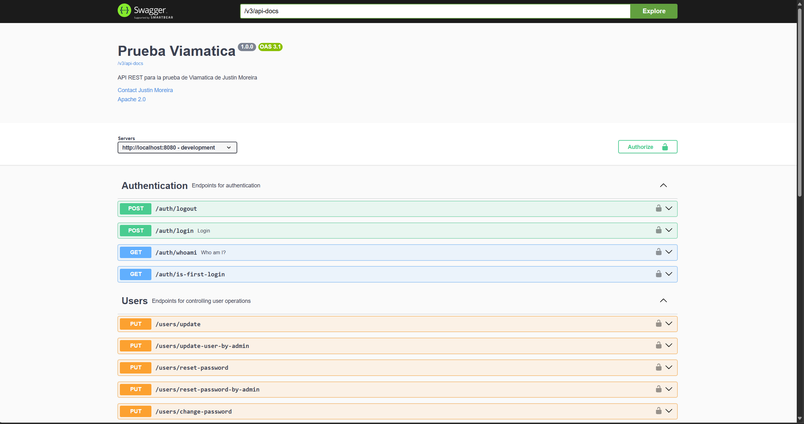

# API REST - Control de usuarios

## 🧩 Contexto

Esta es una API REST desarrollada con una base de datos en **PostgreSQL**, diseñada para el **control de usuarios** dentro de una plataforma.  
Sus principales características son:

- Permite a los usuarios editar su información.
- Los usuarios pueden revisar su historial de ingresos a la plataforma.
- Solo se permite **una sesión activa por usuario**.
- Existe un **administrador con control total**, creado por defecto la primera vez que se ejecuta la API.

🔒 **Credenciales del administrador por defecto** (ajustables desde `application.properties`):

- **Usuario:** `justin@mail.com`  
- **Contraseña:** `@justin123`

Cuando el administrador cree un nuevo usuario, las credenciales serán enviadas automáticamente al correo personal del usuario. Podrá iniciar sesión con su **correo** o **nombre de usuario**, y acceder a sus funciones correspondientes.

---

## 🚀 Instrucciones para levantar el backend

1. Clona o descarga este repositorio.
2. Crea una base de datos en PostgreSQL con el siguiente nombre:prueba-viamatica
> Si deseas usar otro nombre, recuerda actualizar el valor en el archivo `application.properties`.
3. Ejecuta la aplicación backend.

---

## 📄 Documentación Swagger

La API REST está documentada con **Swagger**. Para acceder a los endpoints, abre el siguiente enlace en tu navegador:
http://localhost:8080/swagger-ui.html
> ⚠️ Si cambias el puerto de ejecución del backend, deberás modificar el puerto también en la URL anterior.

---

## 🛠️ Tecnologías utilizadas

- Java
- Spring Boot
- PostgreSQL
- Swagger

---
## 📸 Imágenes de la aplicación

---

---

---

---

---
